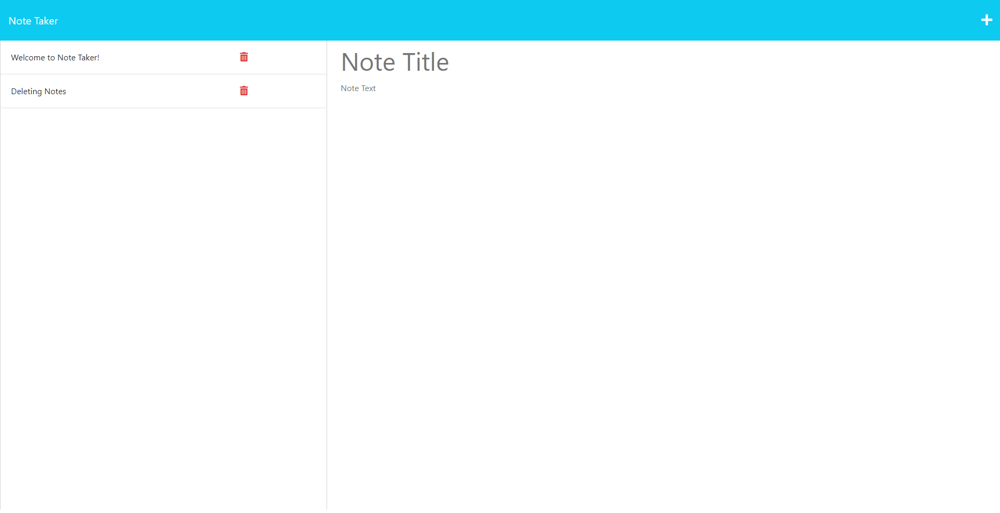
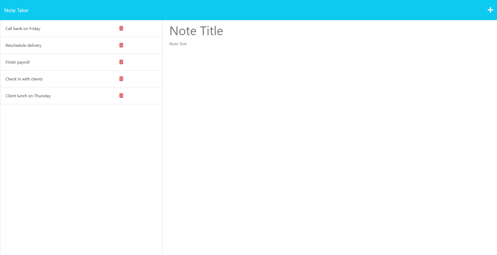
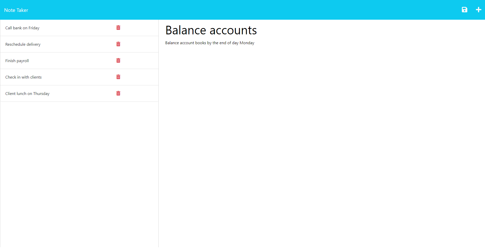

# C11-PersonalJottings
Challenge 11 - Boot Camp

[](https://opensource.org/licenses/MIT)


## Table of Contents

  1. [Description of Assignment](#description-of-assignment)
  2. [About](#about)
      1. [User Story](#user-story)
      2. [Acceptance criteria](#acceptance-criteria)
  3. [Screenshots](#screenshots)
  4. [License](#license)
  5. [Contact](#Contact)
  6. [Final Work Review](#final-work-review)


  ## Description of Assignment

  To create an application called Note Taker that can be used to write and save notes. This application will use an Express.js back end and will save and retrieve note data from a JSON file. The application’s front end has already been created. Starter code was cloned from this repository: https://github.com/coding-boot-camp/miniature-eureka  It is your job to build the back end, connect the two and then deploy the entire application to Heroku.


  ## About 

---
### User Story

```
AS A small business owner
I WANT to be able to write and save notes
SO THAT I can organize my thoughts and keep track of tasks I need to complete

```
### Acceptance Criteria

```
GIVEN a note-taking application
WHEN I open the Note Taker
THEN I am presented with a landing page with a link to a notes page
WHEN I click on the link to the notes page
THEN I am presented with a page with existing notes listed in the left-hand column, plus empty fields to enter a new note title and the note’s text in the right-hand column
WHEN I enter a new note title and the note’s text
THEN a Save icon appears in the navigation at the top of the page
WHEN I click on the Save icon
THEN the new note I have entered is saved and appears in the left-hand column with the other existing notes
WHEN I click on an existing note in the list in the left-hand column
THEN that note appears in the right-hand column
WHEN I click on the Write icon in the navigation at the top of the page
THEN I am presented with empty fields to enter a new note title and the note’s text in the right-hand column
```

## Screenshots








## License

License used for this project - MIT
  * For more information on license types, please reference this website
  for additional licensing information: [https: //choosealicense.com/](https://choosealicense.com/).


  ## Contact

  * GitHub Username: [SMarquis85](https://github.com/SMarquis85)
  * Email: sophienathalie_85@outlook.com


  ## Final Work Review

**"Always leave the code a little cleaner than when you found it."**  This action was applied to ALL JAVASCRIPT files. To create this assignment, I used Lawrence Wilson's Audiobook, references we're found on Google, multiple websites including W3Schools, DEV, GitHub, Insomnia and Tutorialspoint. YouTube was helpful as well as all ZOOM recordings (of previous classes). Looks much cleaner, organised and easier to find what you are looking for. I also received the help of my second tutor, Erik Hoversten. He helped deployed the application to Heroku without any issues or errors.

> **(CARL-VIRT-FSF-PT-04-2023, Challenge 11 / README.md 2023)**
> **(JavaScript Full Stack Developers, Lawrence Wilson; Audiobook (2023) 6hrs and 29mins. )**

## Application Link: Heroku
https://mysterious-citadel-25361-70154c7c7fe8.herokuapp.com/ 

## Github Repository Link:
https://github.com/SMarquis85/C11-PersonalJottings 